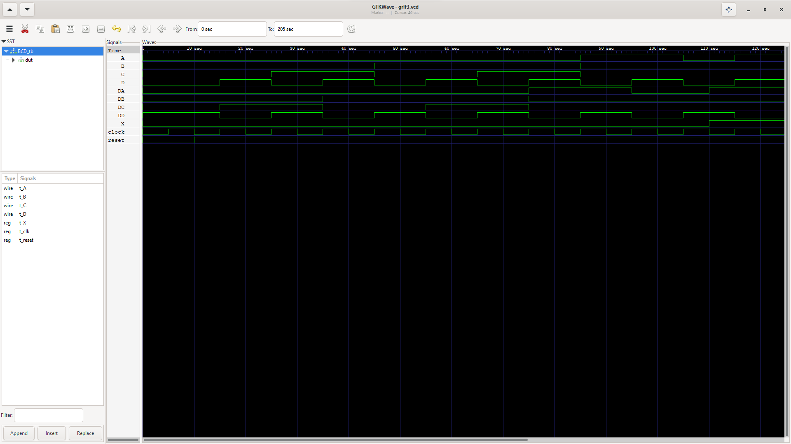

<h1 align="center">
CSARCH HDL Project 3

(Introduction to Computer Organization and Architecture 1)

</h1>

📝**About**:   
   - Verilog structural model HDL program for an *up-down BCD counter*

💻**To run**:

   - Install [iVerilog](https://bleyer.org/icarus/).
   - Run the generated vvp file using the command: `vvp grif3.vvp`
   - Run the waveform file using the command: `gtkwave grif3. vcd`
